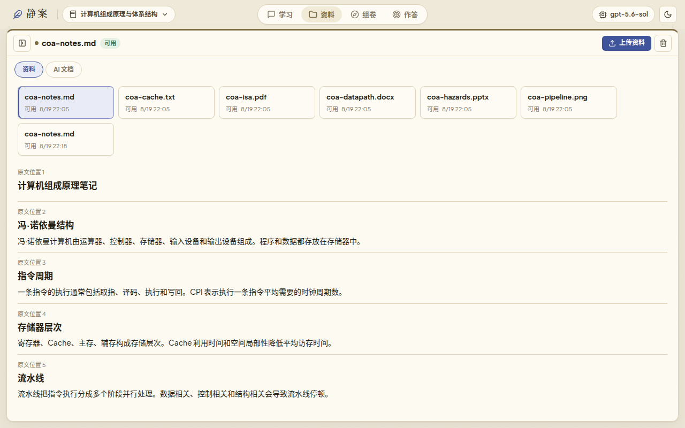
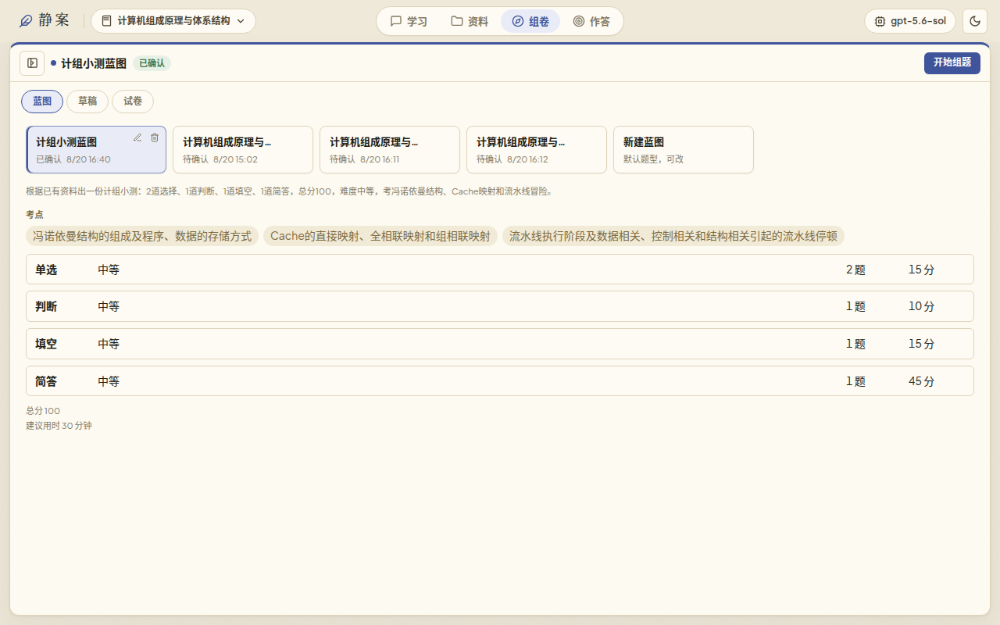
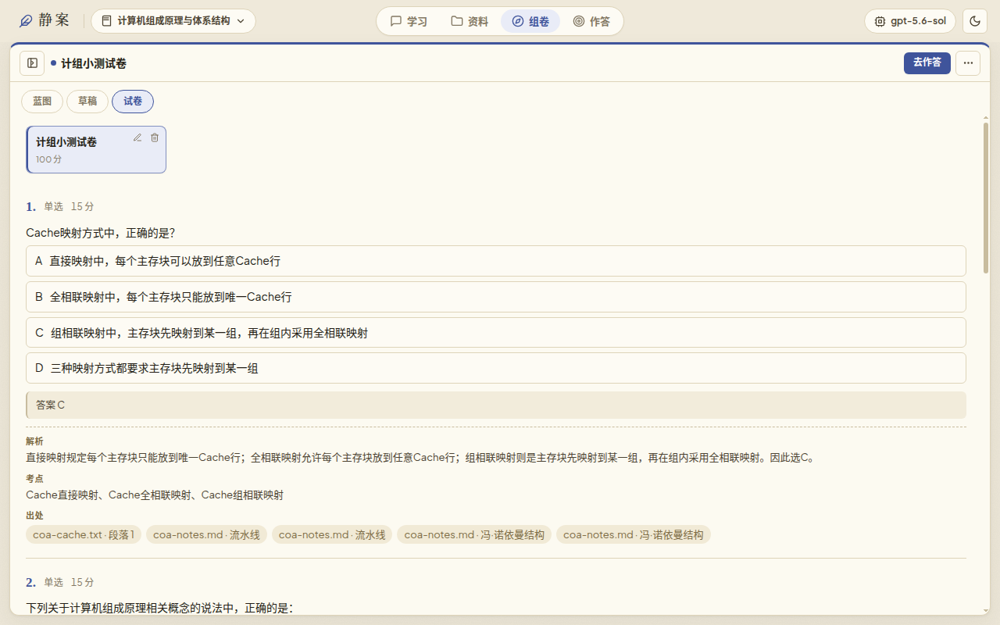
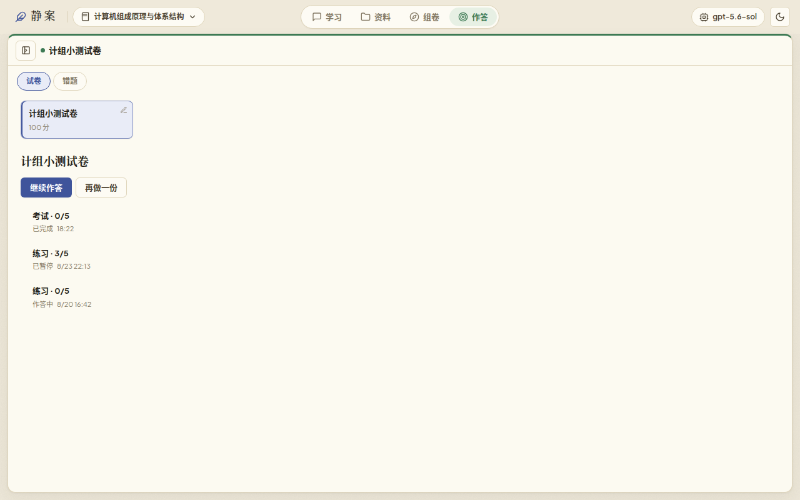

# 静案

Stilldesk. 对着自己的讲义出卷、作答、改错。本地运行，不用注册。

一个人学一门课：资料上传一次，问答能点回原文，先确认题型再组卷，练习或考试，错了再练。网页、打印和 PDF 用同一份试卷。开发时也可以在浏览器里打开。

不是闪卡，不是网搜，不是班级系统。模型用你自己的 API，或本机 Ollama。

## 一次学习

1. **资料** — 讲义、笔记、课件进科目

   

2. **组卷** — 先看蓝图（题型、题量、考点），再出题

   

3. **试卷** — 有答案、解析和出处，可导出题目版或答案版

   

4. **作答** — 练习即时看反馈，考试先做完再揭晓；可继续，可再做一份

   

## 技术栈

- 后端：FastAPI + uvicorn；模型调用使用 httpx，文档解析使用 pypdf、python-docx、python-pptx 和 Pillow，PDF 导出使用 ReportLab
- 前端：当前选择原生 ES modules + HTML + CSS，由 FastAPI 静态托管（前端框架和构建方式不设限制）
- 桌面壳：pywebview（Windows 用 Edge WebView2，macOS 用 WKWebView）；打包用 PyInstaller
- 持久化：本地 JSON 文件。源码运行默认 `data/workspace.json`；打包后默认写到系统用户目录
- 模型协议：OpenAI Chat Completions、OpenAI Responses 和 Ollama
- 测试：pytest + FastAPI TestClient + 可控假模型，不依赖真实网络

## 运行

安装依赖后，一条命令启动（就绪后自动打开浏览器）：

```bash
python3 -m backend.app
```

或：

```bash
./run.sh
```

首次使用：

```bash
python3 -m venv .venv
source .venv/bin/activate
pip install -r requirements.txt
python3 -m backend.app
```

启动后会打印实际地址（默认 <http://127.0.0.1:4173>；4173 被占用时依次尝试 4174–4179）。从源码运行默认打开浏览器；`--desktop` 打开系统窗口（需先 `pip install -r requirements-desktop.txt`）；`--no-browser` 只启动服务。先创建科目空间，再添加模型服务（名称、API 格式、模型、Base URL、可选 API Key），验证后即可发送问题。应用状态和完整会话记录保存在本地数据文件中，重启后自动恢复。

可通过环境变量 `LEARNING_LOOP_DATA_DIR` 修改数据目录。源码运行默认仓库内 `data/`；Windows 打包版默认 `%LOCALAPPDATA%\LearningLoop`，macOS 打包版默认 `~/Library/Application Support/LearningLoop`。

## 桌面应用

面向学习者的发布形态是 Windows 窗口，其次是 macOS。WSL 只作为开发环境，不提供 Linux 安装包。

Windows（在 Windows 原生 PowerShell 里构建，不要在 WSL 里交叉编译，也不必先 push 到 GitHub）：

把当前工作区拷到 Windows 盘，例如在 WSL 里：

```bash
mkdir -p /mnt/c/src
rsync -a --delete \
  --exclude .venv --exclude .venv-desktop --exclude dist --exclude build \
  --exclude data --exclude __pycache__ --exclude .pytest_cache \
  ./ /mnt/c/src/learning-loop-agent/
```

然后在 **Windows PowerShell** 中：

```powershell
cd C:\src\learning-loop-agent
.\packaging\build.ps1
```

脚本会自建 `.venv-desktop`、安装依赖并调用 PyInstaller。产物是 `dist\LearningLoop\LearningLoop.exe`。先双击确认窗口能开，再把整个 `LearningLoop` 文件夹打 zip 发给用户。需要本机已安装 [WebView2](https://aka.ms/webview2install)（Windows 11 通常自带）。

macOS：

```bash
pip install -r requirements-desktop.txt
bash packaging/build-macos.sh
```

产物是 `dist/LearningLoop.app`（菜单栏显示「静案」）。也可以在 GitHub Actions 里用 `desktop-build` workflow 打出 Windows / macOS 工件。

开发时可用热重载：

```bash
uvicorn backend.app.main:app --reload --port 4173
```

## 测试

```bash
pytest -q
```

## API 契约

项目采用契约先行。Ticket 01–16 的目标 HTTP 契约见 [`docs/api.md`](docs/api.md)，
机器可读入口是 [`docs/api/openapi.yaml`](docs/api/openapi.yaml)。Ticket 17–21 复用 Ticket 16
定义的工作流契约，后端已按目标契约实现。FastAPI `/docs` 反映当前实现，不能替代静态主契约。

工作区布局和文案的唯一事实源是 [`docs/frontend-workspaces.md`](docs/frontend-workspaces.md)。
当前契约已使用 `chat_style` 表示无阶段门禁的对话风格，并用 `api_format` 明确选择模型协议。

## 结构

```
backend/app/main.py          FastAPI 应用装配和静态前端托管
backend/app/domain.py        纯领域规则：科目、模型服务、资料库状态
backend/app/store.py          工作区文件持久化
backend/app/model_client.py   Chat Completions、Responses 和 Ollama 模型客户端
backend/app/operations.py     可持久化的通用异步任务生命周期
backend/app/sources.py        资料上传、解析缓存和文件持久化
backend/app/source_parsers.py PDF、DOCX、PPTX、文本和图片解析
backend/app/learning.py       契约版科目、模型、依据会话和学习产物服务
backend/app/attachments.py    消息级临时附件、过期与单消息占用
backend/app/ai_documents.py   AI 资料文档、修改提案和版本恢复
backend/app/core_api.py       科目、模型、会话和学习产物路由
backend/app/issue16_api.py    多会话、附件、模型发现和 AI 资料文档路由
backend/app/exams.py          蓝图、试卷草稿、试卷、作答和反馈状态机
backend/app/exam_api.py       组卷、试卷和作答路由
backend/app/exam_models.py    题目、试卷和作答契约模型
backend/app/rendering.py      统一渲染文档、PDF/Markdown 导出和副本持久化
backend/app/rendering_api.py  渲染与导出路由
backend/app/observability.py  编排运行、脱敏指标和固定评估
backend/app/observability_api.py 观测与评估路由
backend/app/api_models.py     契约响应模型
backend/app/paths.py          资源目录与用户数据目录
backend/app/desktop.py        系统 WebView 窗口
backend/tests/                pytest 领域、API、模型客户端测试
frontend/                     前端（静态托管，桌面窗口与浏览器共用）
packaging/                    PyInstaller 入口与 Windows/macOS 打包脚本
```

领域入口是 `apply_action(workspace, action)`：

```
用户操作 + 当前科目空间状态 -> 下一步状态 + 用户可见结果 + 待执行请求
```

- 模型服务是工作区级配置，可被多个科目复用。
- 每个科目保存独立会话；消息记录发送时的资料上下文和模型快照。
- 修改或删除模型配置不会改写历史消息。
